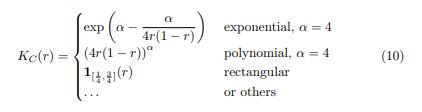
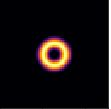
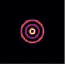
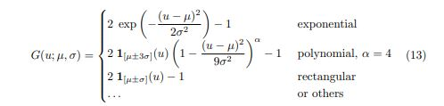
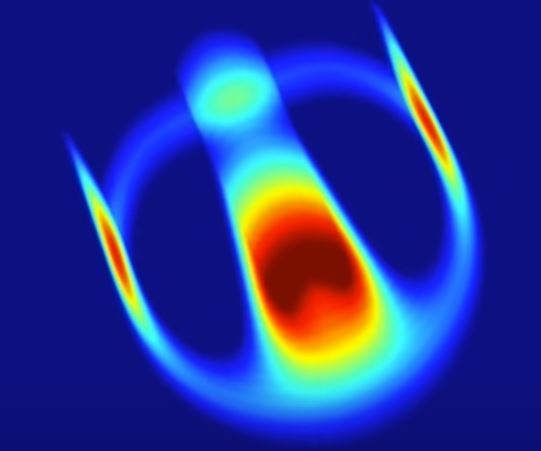
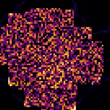
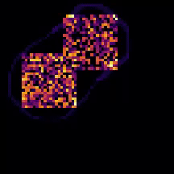
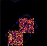
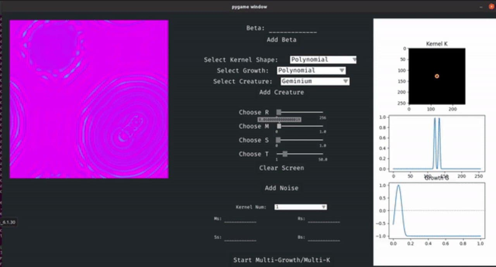

# Replicating Lenia - Artificial Life
### by Sam Cabrera and Alana Huitric

## Abstract

We plan to implement and investigate the Cellular Automata “Lenia” which features a continuous space-time-state and a generalized local rule to generate life-like, self-organizing, autonomous patterns. Furthermore, we plan to extend an idea that the paper “Extended Lenia” presents, which is the use of the average sum of multiple channels for the calculation of an output state. We will extend this idea by investigating if the use of different arithmetic operators such as multiplying, dividing, subtracting, etc. for cross-channel communication to calculate the output state can result in any stable and interesting solitons--an interesting stable form.

## Question

Our primary question is if we can replicate Lenia and qualitatively compare it to its original outputs. Then the question we plan to explore in the extended report is if we can produce a soliton in a version of Lenia where cross channel communication is expanded to arithmetic operations beyond adding.

## Experiment Methodology

Lenia fundamentally attempts to take Conway’s Game of Life and make various parameters of the model as general as possible. There are two main models of Lenia, discrete and continuous, this report will be investigating discrete Lenia for its  faster computation times and simpler implementation. Discrete Lenia builds on GOL by extending the definitions of time, space, and state-space of the model into more granular terms. It defines the kernel using a radially-defined “donut-shaped” kernel and extending it in co-centric rings. It also replaces the rule check in GOL by describing it as a mathematical function. Therefore, the resulting cellular automata display more detailed ‘fuzzy’ artificial life that resembles microorganisms.

To increase the granularity of the state space for each cell on the world grid, the number of states  it has is extended from two: binary zero and one, to a predetermined number of decimal numbers between zero and one. This is one aspect that contributes to the ‘fuzziness’ of the Lenia creatures as each cell does not have to be perfectly dead or alive (0 or 1) but can instead be somewhere in between. 

The kernels in discrete Lenia are composed of a ‘core’ and ‘shell’ that are distributed radially. The kernel core is defined by a unimodal function that takes polar distance “r” as an argument such that it creates a ring-like “bump” kernel. The paper outlines functions that create some form of desired ring shape:

***fig 1: Functions outlined in the original lenia paper to be used as "kernel core"***

***fig 2: Gaussian Bump/Donut Shaped Kernel***

The kernel shell is then defined by using a variable “beta” which is an array typically of length <5 where each value is a real number between 0 and 1. Then for each element in beta it is multiplied by the kernel core function, where the input is the polar distance “r” plus a set distance for each beta after the first. This results in an array of functions that represent multiple co-centric rings as a kernel. 

***fig 3: Complete kernel with a "beta" of length 3***

The growth function is Lenia’s replacement for the rule check in GOL. It is defined as a unimodal function which the paper outlines growth functions in Lenia for being:

***fig 4: Growth functions outlined in the original paper***
 
Where m and s correspond to “growth center” and “growth width” and “u” being the convolution of the kernel and grid. 

Time in GOL consists of a discrete time step, where the rule-check is fully added back to the grid after each step. Instead, in Lenia, time is a positive integer T and dt = 1/t,  which is multiplied by the growth function during each step; this smooths growth such that it happens more gradually than the rapid shifting of GoL. 

To run Lenia,  every step the kernel is convoluted with the world grid, then this result is passed to the growth function, which is multiplied by dt and added back to the world grid. The kernel convolution step can instead be performed as the multiplication of the FFT of the kernel and world grid; this is used for computational efficiency. As Lenia is extended beyond one dimension and one channel, this quickly becomes necessary to achieve reasonable computation times. 

Lenia is further extended in a subsequent paper by the same author, which outlines how Lenia can produce interesting solitons with multiple dimensions, kernels, or worlds. The idea of cross-channel communication, that being taking multiple worlds (visually they are layered on top of eachother) and multiple kernels per world, and adding the crossing the results of some worlds convolutions to others to make new “life.” We plan to take this idea and extend it by using different arithmetic than addition when dealing with how channels interact with each other.

Finding solitons is difficult, especially since the parameters need to be finely tuned to achieve them. To compensate for this, in the first paper it is recommended these parameters should be made adjustable with sliders or a GUI. Thus our experiment also included implementing a GUI in PyGame that would allow for easy adjustment of the variables without having to rerun an animation in a notebook cell.

## Results 

Like the iconic R-pentomino glider is to GOL, the “Orbium” is the iconic glider of Lenia:

fig. 5: "Orbium" glider

We were able to replicate it by sweeping different m and s values around the m and s values for “Orbium” found in the paper and flashing patches of random values for the first few steps: 

fig. 6 Orbium glider generated through variable sweep

A neat thing about lenia is that by tweaking the parameters of a given creature, you can find different similar creatures will may have different large and small variations in shape, size, and behavior. Though in several hundred runs we found only a handful of gliders and most of them imploded or exploted:

***fig 7: Orbium glider explodes into Pattern***

The several hundred rest of the test the patches either simply dissolve or create these interesting reaction-diffusion-equation-esque patterns:

***fig 8: Pattern generated using a more complex kernel than orbium***

In order to get started with our multi channel/multi kernel work we made a GUI to help search for new solitons:

***fig 9: GUI for changing variables more easily live***

## Interpretation

Using the parameters of one of the example notebooks along with the dimensions for one of the creatures ‘Orbium’ we were able to successfully replicate it. However, on our search for other solitons we learned that finding new, or any life at all is quite unlikely. The system needed to create and sustain artificial life is quite fragile and adjusting any of the parameters even slightly can prevent emergent life from appearing at all. This is likely due to the fact that the system is highly granular and even small changes matter. Even after adding basic sliders and inputs, anything other than very specific values would result in the patterns growing uncontrollably or dissolving. This becomes even more difficult moving to variants with even more variables, such as multiple kernels and multiple growth functions, where dozens of variables can determine highly complex creatures like the “fish” or be reduced to waste. Unfortunately at the time we were also unable to implement cross channel communication and multiple kernels.

## Code

The code for this project is in the code folder of this repository, it is a python file and requires pygame dependencies.
## Future Steps

In the future we would like to try and find new solitons as well as different kinds of communication for the extension using the new GUI.

## Causes for Concern

Implementing cross channel communication for certain types of arithmetic operations may produce non soliton results. Despite algorithm being fairly straight forward, implementing cross-channel communication still seems quite difficult and it might be hard to tell if its actually working since the output has a chance of being fairly different than previously shown lifeforms and according to the papers, finding stable solutions is more difficult in these higher more elaborate setups.

## Annotated Bibliography

Lenia – Biology of Artificial Life
Wang-Chak Chan, Bert. Complex Systems, 2019, 28(3), 251-286.
This paper proposes a novel approach to generalizing cellular automaton models like game of life to create “smooth” and more complex “lifeforms” than previous models. The ambition of this paper goes beyond simply implementing a new model, but also presents a taxonomical basis for future nomenclature of not only the “lifeforms” created by the model but rules that could be generalized to all artificial life. To justify the taxonomy of the model and to further understand its lifeforms, the paper also proposes a series of statistical metrics that can be collected for each lifeform to discern how “closely related” life forms are to one another. To achieve a smooth implementation of a cellular automaton, the paper proposes using non-square kernels, instead of using a novel idea of a kernel core and kernel shell that use gaussian surfaces, many of which are toroidal in shape, in combination with the output of the kernel convolution using a more sophisticated growth mapping function, and further generalization of the possible state space, which enables Lenia to be implemented as both a continuous and discrete model. This model is purposed to further explore the emergent phenomena that causes life to appear and results with some stunning creatures that look eerily life-like. The paper ends with a series of possible directions to further explore the system.

Lenia and Expanded Universe
Wang-Chak Chan, Bert, Artificial Life Conference Proceedings 2020
Furthering the work from their first paper, new extensions of Lenia are presented, including multi-dimensional, multi-channel, and multi-kernel additions which result in creating further life-like and increasingly complex artificial life-forms. With a combitionation of better search algorithms to account for the more complex system, the author demonstrates interesting life-forms that were found, which include systems with the ability to “eat” and “grow”, self-replicate, and various more complicated behaviors. Similar to their previous work, the paper ends with a discussion of the pertiance of Lenia toward the study of actual biological systems and makes observations on the parallels between the two.

