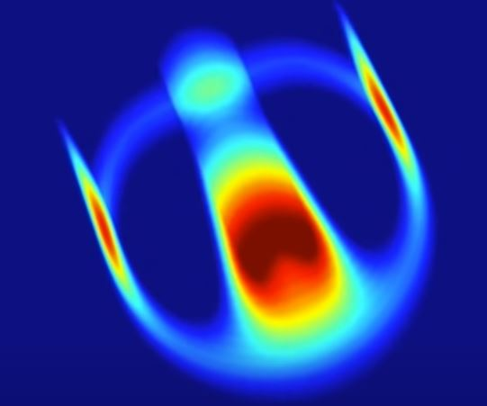

Recreating Lenia and Exploring Cross-Channel Arithmetic Outputs  
Alana Huitric and Sam Cabrera

# Abstract

We plan to implement and investigate the CA “Lenia” which features a continuous space-time-state and a generalized local rule to generate life-like, self-organizing, autonomous patterns. Furthermore, we plan to extend an idea that the paper “Extended Lenia” presents, which is the use of the average sum of multiple channels for the calculation of an output state. We will extend this idea by investigating if the use of different arithmetic operators (multiplying, dividing, subtracting, etc.) for cross-channel communication to calculate the output state can result in any stable and interesting solutions. 

# Annotated Bibliography

Lenia – Biology of Artificial Life 

Wang-Chak Chan, Bert. Complex Systems, 2019, 28(3), 251-286.  
 
This paper proposes a novel approach to generalizing cellular automaton models like game of life to create “smooth” and more complex “lifeforms” than previous models. The ambition of this paper goes beyond simply implementing a new model, but also presents a taxonomical basis for future nomenclature of not only the “lifeforms” created by the model but rules that could be generalized to all artificial life. To justify the taxonomy of the model and to further understand its lifeforms, the paper also proposes a series of statistical metrics that can be collected for each lifeform to discern how “closely related” life forms are to one another. To achieve a smooth implementation of a cellular automaton, the paper proposes using non-square kernels, instead of using a novel idea of a kernel core and kernel shell that use gaussian surfaces, many of which are toroidal in shape, in combination with the output of the kernel convolution using a more sophisticated growth mapping function, and further generalization of the possible state space, which enables Lenia to be implemented as both a continuous and discrete model. This model is purposed to further explore the emergent phenomena that causes life to appear and results with some stunning creatures that look eerily life-like. The paper ends with a series of possible directions to further explore the system.  

Lenia and Expanded Universe 

Wang-Chak Chan, Bert, Artificial Life Conference Proceedings 2020

Furthering the work from their first paper, new extensions of Lenia are presented, including multi-dimensional, multi-channel, and multi-kernel additions which result in creating further life-like and increasingly complex artificial life-forms. With a combitionation of better search algorithms to account for the more complex system, the author demonstrates interesting life-forms that were found, which include systems with the ability to “eat” and “grow”, self-replicate, and various more complicated behaviors. Similar to their previous work, the paper ends with a discussion of the pertiance of Lenia toward the study of actual biological systems and makes observations on the parallels between the two. 

# Experiments

The first thing we would like to replicate from these papers would be the original implementation of discrete Lenia. From there, we will implement the multi-channel extension from “Extended Lenia”. Finally, we will implement the different arithmetic operations for multi-channel communication and attempt to generate a novel soliton from it.  

# Experimental Results

We will test the lenia code by replicating various life-forms found in the original paper, with the first being the “Orbium”:

For multi-channel lenia there are many examples to try to replicate, this self-replicating “aquarium” output:

Result Interpretation
In the original paper, Bert outlines various metrics for describing quantitative aspects of the life-form, if we manage to find a novel soliton in our extension, we will use these to better describe its behavior and to relate it to the rest of Lenia. 

# Causes for Concern

Though a lot of the algorithm is fairly straight forward, implementing cross-channel communication still seems quite difficult and it might be hard to tell if its actually working since the output has a chance of being fairly different than previously shown lifeforms.

# Next Steps

Alana:
  
  - Starting from GOL, implement growth function, work on system visualization
	
Sam:
   - Starting from GOL, Implement non-square kernel and multiple states

